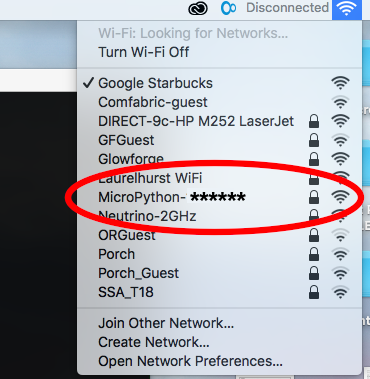
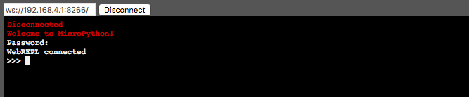
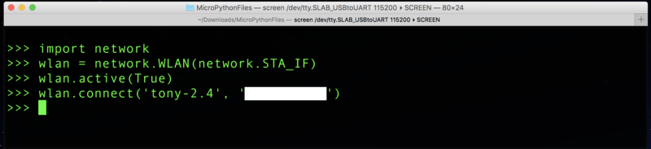
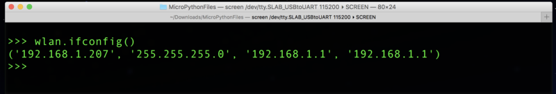
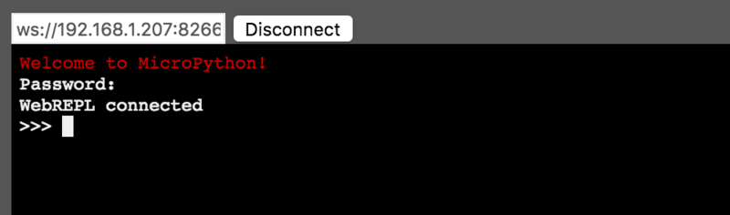

# [MicroPython](http://micropython.org/)

From documentation:

> **MicroPython** is a lean and efficient implementation of the **Python 3** programming language that includes a small subset of the **Python standard library** and is optimised to run on microcontrollers and in constrained environments.

> **MicroPython** is packed full of advanced features such as an interactive prompt, arbitrary precision integers, closures, list comprehension, generators, exception handling and more. Yet **it is compact enough to fit and run within just 256k of code space and 16k of RAM**.
**MicroPython** aims to be as compatible with normal Python as possible to **allow you to transfer code** with ease **from the desktop to a microcontroller** or embedded system.

> **MicroPython is a full Python compiler and runtime** that runs on the bare-metal. You get an **interactive prompt (the REPL)** to execute commands immediately, along with the ability **to run and import scripts from the built-in filesystem**. The REPL has history, tab completion, auto-indent and paste mode for a great user experience.

## More about [MicroPython language](http://docs.micropython.org/en/latest/reference/index.html)

### Micropython port

**MicroPython** supports different boards, RTOSes, and OSes, and can be relatively easily adapted to new systems. **MicroPython** with support for a particular system is called a **“port”** to that system. **Different ports may have widely different functionality**. In that sense, implementation of **MicroPython** to **ESP32** corresponds to a **MicroPython port**.

## MicroPython for ESP32

Take a look on [Quick reference for the ESP32](http://docs.micropython.org/en/latest/esp32/quickref.html).

We are gonna follow [Getting started with MicroPython on the ESP32](http://docs.micropython.org/en/latest/esp32/tutorial/intro.html)

Download the [firmware for the ESP32](https://micropython.org/download#esp32).

#### First: erase your device with [esptool.py](https://github.com/espressif/esptool/)

As `sudo`, run:

```
# pip install esptool
```

Then

```
# esptool.py --chip esp32 --port /dev/ttyUSB0 erase_flash
```

And finally

```
# esptool.py --chip esp32 --port /dev/ttyUSB0 --baud 460800 write_flash -z 0x1000 esp32-version.bin
```

Expected output:

```
esptool.py v2.5.0
Serial port /dev/ttyUSB0
Connecting......
Chip is ESP32D0WDQ6 (revision 1)
Features: WiFi, BT, Dual Core, 240MHz, VRef calibration in efuse
MAC: 30:ae:a4:c1:2b:94
Uploading stub...
Running stub...
Stub running...
Changing baud rate to 460800
Changed.
Configuring flash size...
Auto-detected Flash size: 4MB
Compressed 1549888 bytes to 970594...
Wrote 1549888 bytes (970594 compressed) at 0x00001000 in 22.9 seconds (effective 541.2 kbit/s)...
Hash of data verified.

Leaving...
Hard resetting via RTS pin...
```

## Getting a MicroPython REPL prompt

**REPL** stands for **Read Evaluate Print Loop**, and is the name given to the **interactive MicroPython prompt** that you can access on the **ESP8266** and **ESP32**. Using the **REPL** is the easiest way to test out the code and run commands. Since both, **ESP8266** and **ESP32**, are two **Espressif chips** that are very similar when it comes to using **MicroPython** on them, one must follow the [ESP8266 tutorial - Getting a MicroPython REPL prompt](http://docs.micropython.org/en/latest/esp8266/esp8266/tutorial/repl.html)

The REPL is always available on the UART0 serial peripheral, which is connected to the pins GPIO1 for TX and GPIO3 for RX. The baudrate of the REPL is 115200. If your board has a USB-serial convertor on it then you should be able to access the REPL directly from your PC. Otherwise you will need to have a way of communicating with the UART.

To access the prompt over USB-serial you need to use a terminal emulator program. First, install **picocom:**

```
# apt install picocom
```

Then, run:

```
# picocom /dev/ttyUSB0 -b115200
```

Expected output looks like:

```
picocom v3.1

port is        : /dev/ttyUSB0
flowcontrol    : none
baudrate is    : 115200
parity is      : none
databits are   : 8
stopbits are   : 1
escape is      : C-a
local echo is  : no
noinit is      : no
noreset is     : no
hangup is      : no
nolock is      : no
send_cmd is    : sz -vv
receive_cmd is : rz -vv -E
imap is        :
omap is        :
emap is        : crcrlf,delbs,
logfile is     : none
initstring     : none
exit_after is  : not set
exit is        : no

Type [C-a] [C-h] to see available commands
Terminal ready
```

Then press `Enter` a few times. You should see the **Python REPL prompt**, indicated by `>>>`. **Then you can work!!**

But be careful. Let's say you want to *turn on* the `LED_BUILTIN` attached in your **ESP32**. In the root web page [MicroPython](http://micropython.org/), you will see next example you can run in **REPL prompt**:

```python
import pyb

# turn on an LED
pyb.LED(1).on()

# print some text to the serial console
print('Hello MicroPython!')
```

But when you try:

```python
import pyb
```

Output is:

```python
import pyb
Traceback (most recent call last):
  File "<stdin>", line 1, in <module>
ImportError: no module named 'pyb'
```

This happens because the `pyb module` exists for **PyBoard** in the **MicroPython** family of ports. So, the **MicroPython compiled for ESP32** does not have a `pyb module` and you must use the `machine module` instead:

```python
import machine
pin = machine.Pin(2, machine.Pin.OUT)
pin.on()
pin.off()
```

In **LOLIN32 lite**, the `LED_BUILTIN` is at `pin 22`, then last code must change to:

```python
import machine
pin = machine.Pin(22, machine.Pin.OUT)
pin.on()
pin.off()
```

Note that `on` method of a Pin **might** turn the LED **off** and `off` might turn it **on** (or vice versa), depending on how the LED is wired on your board. To resolve this, `machine.Signal class` is provided.

## [class Signal – control and sense external I/O devices](https://docs.micropython.org/en/latest/library/machine.Signal.html)

## General board Control

- **By line:** the **Python REPL prompt** is indicated by `>>>` and you can run code line by line.

- **Paste mode**: it is useful to paste a large slab of **Python code** into the **REPL**. In order to activate it use: `(ctrl-E)`:

```python
paste mode; Ctrl-C to cancel, Ctrl-D to finish
===
```

## Other control commands

There are four other control commands:

- `Ctrl-A` on a blank line will enter raw **REPL** mode. This is like a permanent paste mode, except that characters are not echoed back.
- `Ctrl-B` on a blank like goes to normal **REPL** mode.
- `Ctrl-C` cancels any input, or interrupts the currently running code.
- `Ctrl-D` on a blank line will do a soft reset.

Note that `ctrl-A` and `ctrl-D` do not work with **WebREPL**.

## [WebREPL - a prompt over WiFi](https://learn.adafruit.com/micropython-basics-esp8266-webrepl/access-webrepl)

**WebREPL** allows you to use the **Python prompt** over **WiFi**, connecting through a browser. The latest versions of *Firefox* and *Chrome* are supported.

### Enable WebREPL

Before connecting to **WebREPL**, you should set a `password` and **enable** it via a normal **serial connection**.
After **MicroPython 1.8.6** release, the **WebREPL** is not enabled by default for security reasons and must be switched on with next one time command run through the serial port:

```python
import webrepl_setup
```

You will be prompted to **enable** or **disable** the **WebREPL**, and to set a `password`.  Enter your choices for both prompts then press `y` when prompted to save and reboot:

```python
import webrepl_setup
WebREPL daemon auto-start status: disabled

Would you like to (E)nable or (D)isable it running on boot?
(Empty line to quit)
> E
To enable WebREPL, you must set password for it
New password (4-9 chars): *********
Confirm password: *********
Changes will be activated after reboot
Would you like to reboot now? (y/n) y
```

### Access WebREPL

Once the **WebREPL** is running you can connect to it over the **ESP32's WiFi radio**.

> If the board isn't connected already to a wireless access point then it will create one which you can connect to from your computer.

To connect to the **board's WiFi network** look for a WiFi network advertised by an **ESSID** that looks like  **MicroPython-xxxxxx**, where the **x’s** are replaced with part of the **MAC (Media Access Control) address** of your device (so will be the same everytime, and most likely different for all **ESP32** chips).



The **ESSID** or **Extended Service Set Identifier** is used when the network incorporates a **WiFi access point (AP)**. In order to get **MAC address** run:

```python
import network
import ubinascii
mac = ubinascii.hexlify(network.WLAN().config('mac'),':').decode()
print(mac)
```

Output would be like:

```
01:23:45:67:89:ab
```

You will need to enter the password `micropythoN` (note the upper-case `N`) to connect to the **board's access point**. Its **IP address** will be `192.168.4.1` once you connect to its network.

Next you'll need to have available the **WebREPL client** web page on your machine. For your convenience, **WebREPL client** is hosted at http://micropython.org/webrepl. Alternatively, you can install it locally from the the **GitHub** repository https://github.com/micropython/webrepl.

If you downloaded the **WebREPL client**, then extract the files and open `webrepl.html` in your browser. Note you can't access the WebREPL client page directly from the **ESP32** board. To save space in flash memory the **ESP32** only provides a **websocket** interface and not the actual client webpage. You'll need to download the **WebREPL client** page ahead of time or access it from the internet.

Once the **WebREPL client** page is loaded you should see something like the following:


Now make sure your computer is connected to the **ESP32's WiFi network**, then click the `Connect` button (using the default address of `ws://192.168.4.1:8266/` next to the button).

Once connected the **WebREPL** should prompt you to enter the `password` you set while running the `webrepl_setup` command earlier. Enter the `password` that you set to continue.



### Access WebREPL from other WiFi Networks

Accessing the **WebREPL** over the **ESP32's own WiFi access point** like above is handy if there's no router or other WiFi network available. However if you do have access to a **WiFi network** you can instead connect the **ESP32** to this network and access the **WebREPL** from any other machine on the network. This makes it easier to use the **WebREPL** without losing access to the internet or your own WiFi network on a laptop that can only be connected to one WiFi network at a time.

To use the **WebREPL** on another WiFi network you'll first need to connect the ESP32 to the WiFi network.

The [MicroPython ESP32 documentation](http://docs.micropython.org/en/latest/esp32/quickref.html#networking) shows a few simple commands to connect to a network. From the **serial REPL** (don't use the **WebREPL** since you'll lose access when the commands change to a different WiFi network!) run the following commands:

```python
import network
wlan = network.WLAN(network.STA_IF)
wlan.active(True)
wlan.connect('essid', 'password')
```

where `essid` is the name of the **WiFi access point ESSID**, and `password` is the password required to use the access point (try an empty string `''` **if no password is required**).



After a moment the **ESP32** should connect to the **WiFi network**.  You can run the `ifconfig` function to check that the board has been assigned an **IP address** and is on the network:

```python
wlan.ifconfig()
```



Notice the first result from the `ifconfig` call is the **IP address** assigned to the **ESP32** (`192.168.1.207` in this example, but it will differ depending on your **WiFi network**). If you don't see an **IP address** then something is wrong with the **WiFi configuration** or **connection to the network**. Double check the **ESSID** and `password` are correct and try the connect call again.

Once the board is connected to the **WiFi network** enable the **WebREPL**:

```python
import webrepl
webrepl.start()
```

Expected output:

```
WebREPL daemon started on ws://192.168.1.207:8266
Started webrepl in normal mode
```

By default the **WebREPL** is always listening on `192.168.4.1` which is the **ESP32's access point**, but `192.168.1.207` is the **IP address** assigned to **ESP32** on the **WiFi network**. Then one must open the **WebREPL client** and use the **IP address** of the board on your network instead of the `192.168.4.1` default:



## [Networking](http://docs.micropython.org/en/latest/esp32/quickref.html#networking)

The `network` module:

```python
import network
```
Important methods:

- **Create station interface**

```python
wlan = network.WLAN(network.STA_IF)
```

- **Activate the interface**

```python
wlan.active(True)
```

- **Scan for Access Points (AP)**

```python
wlan.scan()
```

- **Check if the station is connected to an AP**

```python
wlan.isconnected()
```

- **Connect to an AP**

```python
wlan.connect('essid', 'password')
```

- **Get the interface's MAC adddress**

```python
wlan.config('mac')
```

- **Get the interface's `IP/netmask/gw/DNS` addresses**

```python
wlan.ifconfig()
```

- **Create access-point interface**

```python
ap = network.WLAN(network.AP_IF)
```

- **Set the ESSID of the access point**

```python
ap.config(essid='ESP-AP')
```

- **Activate the interface**

```python
ap.active(True)
```

A useful function for connecting to your **local WiFi network** is:

```python
def do_connect():
    import network
    wlan = network.WLAN(network.STA_IF)

    if wlan.isconnected() == True:
      print("Already connected")
      return wlan.isconnected()

    wlan.active(True)
    if not wlan.isconnected():
        print('Connecting to network...')
        wlan.connect('essid', 'password')
        count = 0
        while not wlan.isconnected() and count < 1000000:
            count += 1
            pass
    print('Network config:', wlan.ifconfig())
    return wlan.isconnected()
```

A counter `count` was added for avoiding infinite cycle.

Once the network is established the `socket` module can be used to create and use **TCP/UDP sockets** as usual, and the `urequests` module for convenient **HTTP requests**.

#### Sockets

 A **socket** represents an **endpoint** on a **network device**, and when two sockets are connected together communication can proceed. **Internet protocols** are built on top of **sockets**, such as **email (SMTP)**, the **web (HTTP)**, **telnet**, **ssh**, among many others. Each of these protocols is assigned a specific `port`, which is just an integer. Given an **IP address** and a `port` number you can connect to a **remote device** and start talking with it.

# Working with scripts

Until now, we have used **WebREPL** to prove code in our board. Nevertheless, tt would be useful to have an script with the above function for connecting to our **local WiFi network**, so we have to learn how to put a **script** in **filesystem** and running it from **system boot**.

## List files in filesystem - `os` module

```python
import os
```

- **To list files in filesystem**

```python
os.listdir()
```

Expected output:

```
['boot.py', 'webrepl_cfg.py']
```

## [Uploading files to the file system](https://techtutorialsx.com/2017/06/04/esp32-esp8266-micropython-uploading-files-to-the-file-system/)

## [Running a script from the file system](https://techtutorialsx.com/2017/06/04/esp32-esp8266-micropython-running-a-script-from-the-file-system/)

First, we need to put our code in a script, let's say `connect_local_wifi.py` and then upload the file to the **ESP32** using `ampy`.

### [Adafruit MicroPython Tool (ampy)](https://github.com/pycampers/ampy)

**Ampy** is meant to be a simple command line tool to manipulate files and run code on a **CircuitPython** or **MicroPython** board over its serial connection. With **ampy** you can send files from your computer to the board's file system, download files from a board to your computer, and even send a **Python script** to a board to be executed.

- **To install it** (as root)

```
# pip install adafruit-ampy
```

Once installed verify you can run the **ampy** program and get help output:

```
$ ampy --help
```
You should see usage information displayed like below:

```
Usage: ampy [OPTIONS] COMMAND [ARGS]...

  ampy - Adafruit MicroPython Tool

  Ampy is a tool to control MicroPython boards over a serial connection.
  Using ampy you can manipulate files on the board's internal filesystem and
  even run scripts.

Options:
  -p, --port PORT  Name of serial port for connected board.  [required]
  -b, --baud BAUD  Baud rate for the serial connection. (default 115200)
  -d, --delay DELAY Delay in seconds before entering RAW MODE (default 0)
  --help           Show this message and exit.

Commands:
  get  Retrieve a file from the board.
  ls   List contents of a directory on the board.
  put  Put a file on the board.
  rm   Remove a file from the board.
  run  Run a script and print its output.
```

#### To list the files on the board

```
# ampy --port /dev/ttyUSB0 ls
```

#### To upload files to the board

```
# ampy --port /dev/ttyUSB0 put connect_local_wifi.py
```

Be aware not to be using `picocom` or other program which blocks the **port** before using `ampy`.

### To read file contents

Using `picocom` to access to the board, we can run:

```python
file = open('connect_local_wifi.py', 'r')
print(file.read())
file.close()
```
### To run the script

Finally, to run the script, we just need to import it, since it will act like a regular **Python module**. Upon importing, all the executable statements will run, and the functions defined will be available.

```python
import connect_local_wifi
connect_local_wifi.do_connect()
```

## Modifying `boot.py`

Run following command to see `boot.py` content:

```
# ampy --port /dev/ttyUSB0 get boot.py
```

Expected output:

```python
# This file is executed on every boot (including wake-boot from deepsleep)
#import esp
#esp.osdebug(None)
import webrepl
webrepl.start()
```

Create a new file `boot.py` in your PC with next code:

```python
# This file is executed on every boot (including wake-boot from deepsleep)
#import esp
#esp.osdebug(None)
import machine
pin = machine.Pin(22, machine.Pin.OUT)

import connect_local_wifi
status = connect_local_wifi.do_connect()

if status:
    import webrepl
    webrepl.start()

    print('Boot succesful')
    pin.on()
else:
    print('On boot: Wifi connection failed')
    pin.on()
```

Last code is designed in such a way that `pin 22` lights on while **WiFi connection** is carried out, after which `webrepl.start()` is executed, and finally `pin 22` turns off. Then overwrite `boot.py` on the board with:

```
# ampy --port /dev/ttyUSB0 put boot.py
```

Now use `picocom` to access to the board, and then `Ctrl-D` to **reboot** the board. expected output:

```
Network config: ('192.168.1.207', '255.255.255.0', '192.168.1.1', '190.168.1.1')
WebREPL daemon started on ws://192.168.1.207:8266
Started webrepl in normal mode
Boot succesful
OSError: [Errno 2] ENOENT
MicroPython v1.10-298-g47e76b527 on 2019-04-18; ESP32 module with ESP32
Type "help()" for more information.
```

Everything was successful, but there is one **error**: `OSError: [Errno 2] ENOENT`. In [MicroPython forums](https://forum.micropython.org/viewtopic.php?t=3919), it is said that this error appears because `main.py` is missing in **filesystem**, so it can be resolved uploading an empty `main.py` file to the board.

Now we are ready to use connect our board to a battery and connect to it using **WebREPL** directly with **WebREPL client** and without **serial connection**.

## [MicroPython libraries - For ESP32](http://docs.micropython.org/en/latest/library/index.html)

**MicroPython** is highly configurable, and each port to a particular board/embedded system makes available only a subset of **MicroPython libraries**.

On some **ports** you are able to discover the available, **built-in libraries** that can be imported by entering the following at the **REPL**:

```python
help('modules')
```

Expected output:

```
__main__          framebuf          ssl               upysh
_boot             gc                struct            urandom
_onewire          hashlib           sys               ure
_thread           heapq             time              urequests
_webrepl          inisetup          ubinascii         uselect
apa106            io                ucollections      usocket
array             json              ucryptolib        ussl
binascii          machine           uctypes           ustruct
bluetooth         math              uerrno            utime
btree             micropython       uhashlib          utimeq
builtins          neopixel          uhashlib          uwebsocket
cmath             network           uheapq            uzlib
collections       ntptime           uio               webrepl
dht               onewire           ujson             webrepl_setup
ds18x20           os                umqtt/robust      websocket_helper
errno             random            umqtt/simple      zlib
esp               re                uos
esp32             select            upip
flashbdev         socket            upip_utarfile
Plus any modules on the filesystem
```
Beyond the **built-in libraries**, many more modules from the **Python standard library**, as well as further **MicroPython** extensions to it, can be found in [micropython-lib](http://docs.micropython.org/en/latest/reference/glossary.html#term-micropython-lib).
