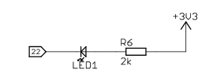

# [ESP32 - Introduction to LOLIN32 Lite board](http://txapuzas.blogspot.com/2018/01/introduccion-esp32-lolin32-lite.html)

The board used in this project was [Wemos LOLIN32 Lite](https://wiki.wemos.cc/products:lolin32:lolin32_lite),
whose major advantage is to provide a chip integrated with Wifi, bluetooth and other
features for a low price, besides to optimized components with very low battery consumption.

# Chip ESP32

The ESP32 integrates in a single chip:

- Wi-Fi 2.4 GHz
- Bluetooth 4.2
- Xtensa Dual-Core LX6 processor with two cores, each one of 32bits that can operate to 160MHz or 240MHz
- An Ultra Low Power coprocessor that allows to put the chip in deep sleep mode with a very low consumption.

Wifi and Bluetooth are managed by one of the Xtensa cores, whilst the rest of the processes are managed by the other processor.

# LOLIN32 Lite - Features

LOLIN32-Lite board use the chip `CH340C` as **USB-Serial converter**. An important feature is that Linux will detect the board out of the box, nevertheless next link can be used for downloading the corresponding [drive](https://wiki.wemos.cc/downloads).

The chip `ME6211-33` is used as tension regulator and i has the following characteristics:

- **Maximum Output Current:** 500mA（VIN＝5V,VOUT＝3.3V)
- **Dropout Voltage:** **100mV** @ IOUT=100mA
- **Operating Voltage Range:** **2V～6.0V**
- **Highly Accuracy:** ±2％
- **Low Power Consumption:** **50uA**（TYP.）
- **Standby Current:** **0.1uA**（TYP.）
- **High Ripple Rejection:** 70dB@1KHz（ME6211C33）
- **Low output noise:** 50uVrms
- **Line Regulation:** 0.05％（TYP.）

### Remarkable features

- Low consumption both in operation (**50uA**) and in rest (**0,1uA**).
- Operating voltage of **2v～6v** with dropout voltage of **0,1v**. As the ESP32 can operate only in voltage interval **2,3v～3,6v**, the **LOLIN32 Lite** must be supplied with **2,4v～6v**.

According to last feature, next devices can be used to supply an appropiate voltage input:

- **Old mobile charger:** 5v and 500mA

- **Micro USB cable Male - USB Male:** it allows to supply required voltage and current (it often supplies 500mA when connected to our PC), and also it allows to program the chip.

- **Integrated batteries Lipo charger:** it uses chip `TP4054`, and charges from **5v** voltage of the micro-USB connector.

**LED2** is red color and remains light on while battery is charging. Once it is charged, and when it is working only with battery voltage input, the **LED2** remains light off.

- **Litio-Ion battery tipe 18650:** they often supply **3,6v**. They must be used with an adequate battery holder with a suitable connector to **LOLIN32 Lite** board (PH-2; 2.0mm).

- **Lithium polymer battery:** they often supply **3,7v** and can be found with **150mah** to **2000mah**. It must be taken into account that if we desire to use **Wifi** or **Bluetooth**, then **LOLIN32 Lite** must be supplied with at least **500mah**.

In **LOLIN32 lite**, the `LED_BUILTIN` is at `pin 22` and it is a blue color led located above `GPIO22`.

# References

- [Introducción a ESP32: LOLIN32 Lite](http://txapuzas.blogspot.com/2018/01/introduccion-esp32-lolin32-lite.html)
- [ESP32 webpage - Espressiv](http://espressif.com/en/products/hardware/esp32/overview)
- [ESP32 Technical Reference Manual](http://espressif.com/sites/default/files/documentation/esp32_technical_reference_manual_en.pdf)
- [ESP32 datasheet](http://espressif.com/sites/default/files/documentation/esp32_datasheet_en.pdf)
- [The internet of things with ESP32](http://esp32.net/)
- [Wemos webpage](https://wiki.wemos.cc/products:lolin32:lolin32_lite)
- [Esquema eléctrico de Lolin32 Lite](https://wiki.wemos.cc/_media/products:lolin32:sch_lolin32_lite_v1.0.0.pdf)
- [Driver para Lolin32 (CH340C)](https://wiki.wemos.cc/downloads)
